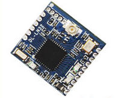

# DL-LN3X
DL-LN3X family 2.4G multi-hop Ad hoc WSN modules driver for TiJOS.

| 条目       | 说明                                |
| ---------- | ----------------------------------- |
| 驱动名称   | DL-LN3X系列 2.4G 无线自组网多跳模块 |
| 适用       | 该驱动适用于DL-LN3X系列 2.4G        |
| 通讯方式   | UART                                |
| Java Class | TiDLLN3X.java                       |
| 图片       |           |
